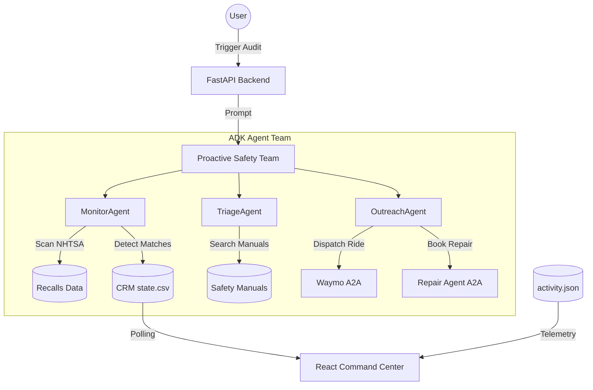

# System Architecture

The Vigil Insurance ecosystem is built as a multi-agent team using the **Google Agent Development Kit (ADK)**. 

## Workflow Overview

The system follows a strict, linear pipeline to ensure safety and data integrity:

1.  **Monitor**: Scans for recalls and matches them to policyholders.
2.  **Triage**: Assesses the severity of the specific recall component.
3.  **Outreach**: Executes autonomous partner dispatches (A2A).
4.  **Follow-up**: Escalates stalled repairs after a time jump.

## Visualizing the Flow

## Data Persistence

- **`state.csv`**: Serves as the single source of truth for policyholder lifecycle states.
- **`activity.json`**: Captures real-time tool execution for the dashboard's "Autonomous Agent Activity" feed.
- **ADK Resumability**: Local SQLite-based session storage allows the agent team to remember conversation context across complex workflows.
